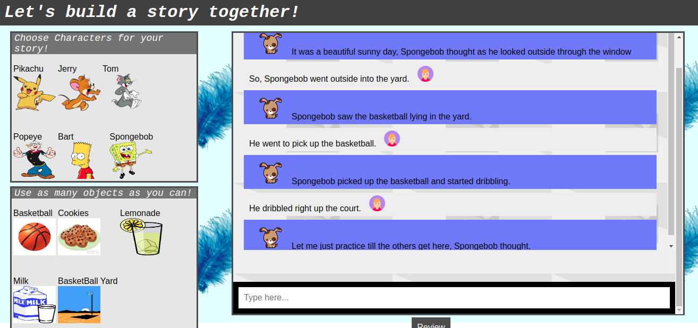

# storyChatBot
Implements a chatbot which suggests a possible continuation to the user's story based on the user's input. The chatbot looks for pre-defined keywords in the user's input and updates some state variables based on the keywords that it finds. The chatbot then identifies the best possible contuation to the story based on the values of these variables as well as some pre-defined rules. Below is a screenshot of the interactive story-writer system which incorporated the chatbot to help users with their stories.

## Story Creation with the chatbot
*Nami* is the name of the chatbot.

*Nami*: It's the perfect weather to be playing outside, Bart thought as he gazed at the clear blue sky.  
*User*: So, Bart decided to go out into the yard.  
*Nami*: Bart saw the basketball lying in the yard.  
*User*: He went up to the basketball and picked it up.  
*Nami*: Bart picked up the basketball and started dribbling.  
*User*: He dribbled upto the hoop and lined up to take a shot.  
*Nami*: Let me just practice till the others get here, Bart thought.  
*User*: So, he continued to practice.  
*Nami*: Bart thought that this'd be a great time for some lemonade!  
*User*: He got some lemonade from the fridge and started to drink it.  
*Nami*: Bart drank the lemonade and felt a sudden surge of energy.  
*User*: Then, he just lied down on the grass.  
*Nami*: Bart thought that this'd be a great time for some ice-cream!  
*User*: So, he got some ice-cream and ate it!  
*Nami*: Pikachu took his skateboard and headed to his house.  
*User*: Cool, Pikachu will be here soon, Bart thought in his head.  
*Nami*: Spongebob took his car and headed to Bart's house.  
*User*: Soon, Spongebob, Pikachu and Bart were in the yard.  
*Nami*: Spongebob saw the basketball lying in the yard.  
*User*: So, he picked it up.  
*Nami*: Bart picked up the basketball and passed it.  
*User*: Spongebob  recieved the pass and dribbled forward.  
*Nami*: Spongebob passed the ball to Spongebob.  
*User*: That is a really neat self-pass, Bart muttered to himself.  
*Nami*: But the pass gets blocked by Pikachu.  
*User*: Pikachu is lightning quick and takes a shot!  
*Nami*: Did you see that shot?, Spongebob exclaimed!  

#### The chatbot tries to understand the context of the story by looking for certain pre-defined keywords in the user's input, and seems to do an alright job in the example above. 

